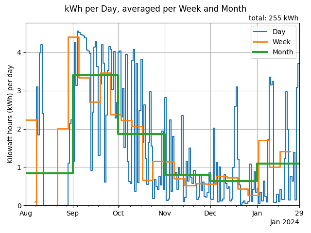

# Analyze Home Assistant Solar Production

Python Pandas script to analyze the Solar Power Production data stored in a Home Assistant database.

- [fetch-db.sh](fetch-db.sh): shell script to download the database from a server. Adjust hostname and dir.
- [analyze.py](analyze.py): extract, convert and plot the data

## Generated Charts

- kWh per hour, comparing last 7 days
- kWh per day
- kWh per week
- kWh per month
- joined chart of kWh per day, averaged per week and month, see example below

## SonarQube Code Analysis

At [sonarcloud.io](https://sonarcloud.io/summary/overall?id=entorb_analyze-ha-energy&branch=main)
